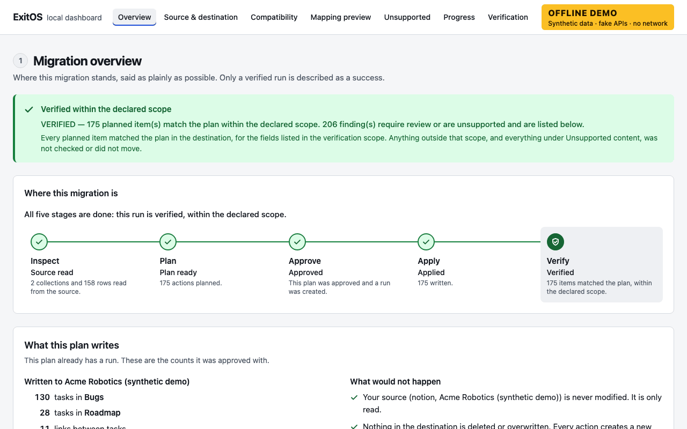
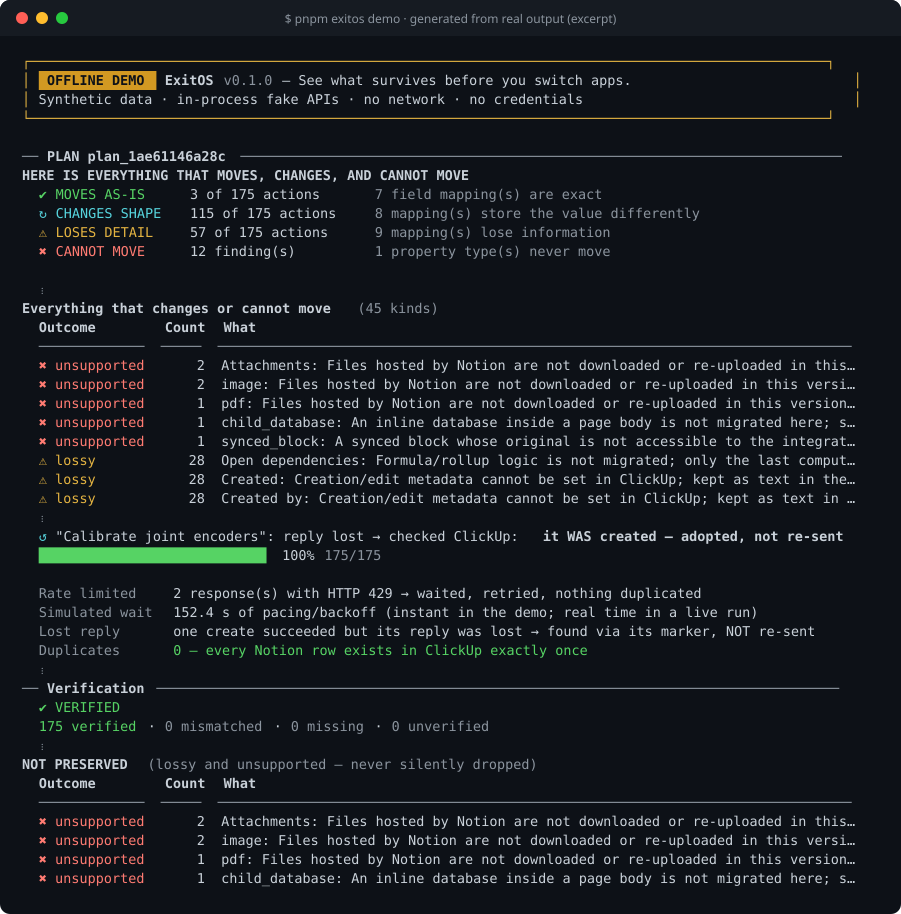
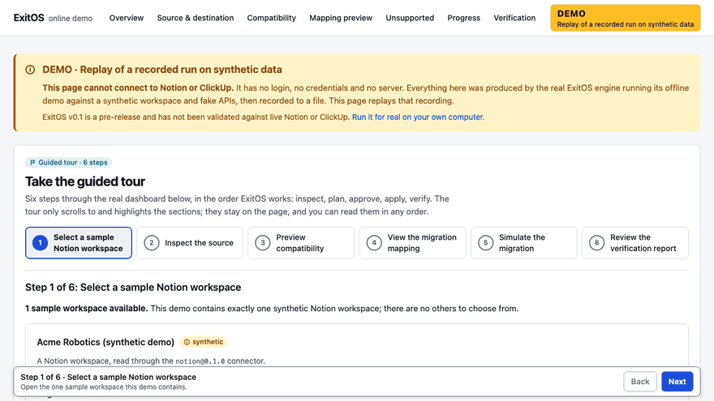
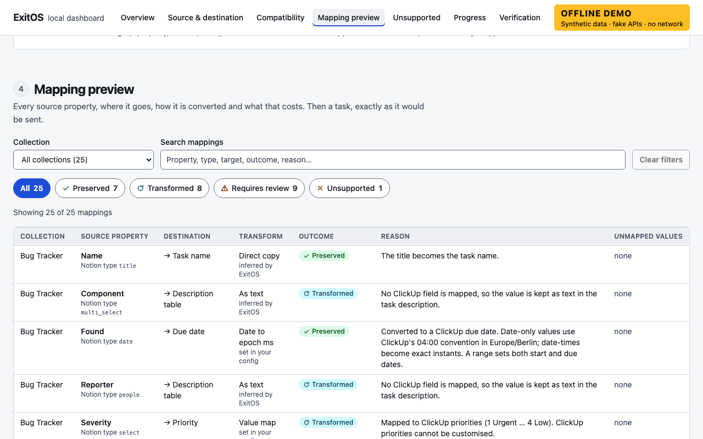
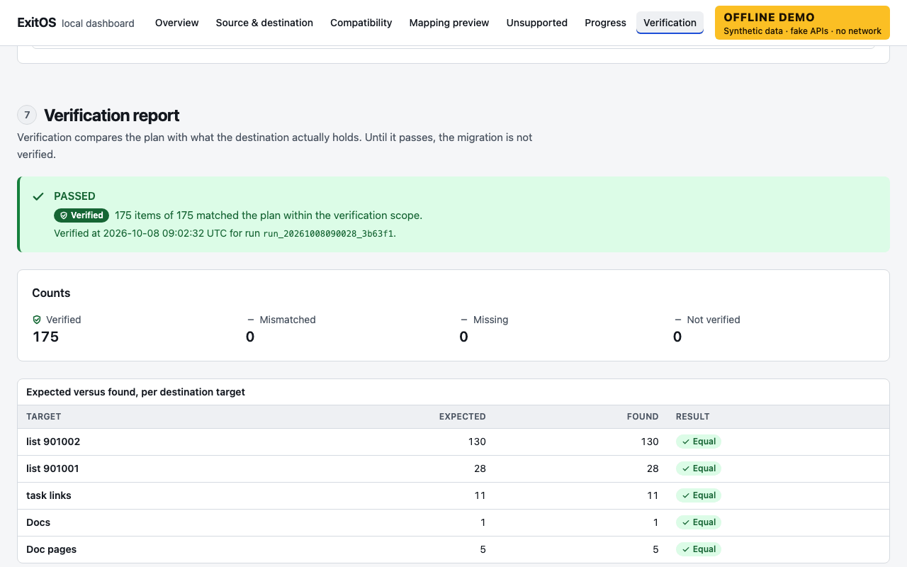

<div align="center">

<picture>
  <source media="(prefers-color-scheme: dark)" srcset="docs/assets/logo-dark.svg">
  
</picture>

**English** | [한국어](README.ko.md)

### See what survives before you switch apps.

Preview a migration, approve it, apply it, and verify the result — with everything that is lost or
unsupported listed up front. Open source, local-first, no account.

[](https://github.com/Choitim/EXITOS/actions/workflows/ci.yml)
[](LICENSE)
[](package.json)
[](docs/validation-log.md)

[Quick start](#quick-start) · [Offline demo](#offline-demo) · [How it works](#how-it-works) ·
[Notion → ClickUp](#notion--clickup-migration) · [Contributing](#contributing)



<sub>The local dashboard (`exitos ui --demo`) on the built-in synthetic workspace. Real output, fake data.</sub>

</div>

## What is ExitOS?

Moving your work from one app to another usually means: export, import, and then discover what broke.
ExitOS changes the order.

1. **It reads first.** ExitOS looks at your Notion workspace (read-only) and shows you a **plan**: what
   will be _preserved_, what will _change shape_, what _requires review_ and what _cannot move at all_.
2. **You approve that exact plan.** Nothing is written until you do, and the source is never modified.
3. **It applies the plan safely.** If a rate limit, a crash or a lost reply interrupts it, it resumes
   without creating duplicates.
4. **It verifies the result.** ExitOS compares the plan with what ClickUp actually holds, and the final
   report still lists everything that did _not_ survive.

ExitOS runs on your own machine. Your data goes only to the two APIs you configure (Notion and ClickUp),
and there is no telemetry. **v0.1 migrates Notion database rows to ClickUp tasks.**

> **Status: v0.1 pre-release.** The engine, both connectors, the CLI and the dashboard work and are
> extensively tested against API-shaped fakes. **They have not been validated against live Notion or
> ClickUp workspaces yet**, so use test workspaces first ([guide](docs/live-sandbox-testing.md),
> [validation log](docs/validation-log.md)). Notion pages → ClickUp **Docs** is **experimental**. ClickUp's
> own importer is free and may be all you need
> ([honest comparison](docs/competitive-landscape.md)).

## Why ExitOS?

| What usually goes wrong                            | What ExitOS does about it                                                                                                                 |
| -------------------------------------------------- | ----------------------------------------------------------------------------------------------------------------------------------------- |
| You learn what was lost only **after** the import. | A read-only **plan** lists everything that moves, changes, requires review or cannot move, before anything is written.                    |
| What got lost is hard to know.                     | Every unsupported or lossy item is a coded finding; the report always has a **NOT PRESERVED** section.                                    |
| A big import fails halfway.                        | Checkpointed **apply** that resumes after a crash or rate limit and is built not to re-create what already exists (proved against fakes). |
| "Imported" is not "correct".                       | **Verify** compares the plan with what the destination really holds. A run is complete only when it verifies.                             |
| Your data passes through someone else's cloud.     | **Local-first**: no account, no telemetry, only the two APIs you configure.                                                               |
| The tool is a black box.                           | An **open connector SDK** with a conformance kit; the engine and both connectors are in this repository.                                  |

Where ExitOS is **weaker**, honestly: it supports one migration (Notion → ClickUp), it has not been run
against live workspaces yet, it does not transfer attachment files, there is no hosted version, and there is
no automatic undo (ClickUp's own importer can delete an import made in the last 10 days). Several of these
ideas exist elsewhere too, and some claims above are only partly proven. The
[evidence table](docs/competitive-landscape.md#evidence-for-our-positioning) says, claim by claim, what
proves it in this repository and what the alternatives do.

## How it works

```
Inspect  →  Plan  →  Approve  →  Apply  →  Verify
(read)     (read)    (you, by    (writes to  (read)
                      plan id)   the destination only)
```

| Step        | Command                                    | What happens                                                                  |
| ----------- | ------------------------------------------ | ----------------------------------------------------------------------------- |
| **Inspect** | `exitos inspect notion` / `clickup`        | Lists what each token can see. Read-only.                                     |
| **Plan**    | `exitos plan notion clickup`               | Builds a hash-sealed plan and prints what moves and what does not. Read-only. |
| **Approve** | `exitos apply --plan … --approve <planId>` | You approve one specific plan by its id. An edited plan is refused.           |
| **Apply**   | (same command)                             | Writes to ClickUp only, with bounded concurrency, retries and checkpoints.    |
| **Verify**  | `exitos verify` · `exitos report`          | Compares plan and destination; reports what was **not** preserved.            |

Everything ExitOS reports uses six plain states, in the terminal, the dashboard and the docs:

| State               | Meaning                                                     |
| ------------------- | ----------------------------------------------------------- |
| **Preserved**       | Moves as-is.                                                |
| **Transformed**     | Arrives, but in a different shape (for example as text).    |
| **Requires review** | Arrives, but some detail is lost. Look at it.               |
| **Unsupported**     | Cannot move. It is listed, never silently dropped.          |
| **Failed**          | A write failed (and what depended on it was not attempted). |
| **Verified**        | The destination was read back and matches the plan.         |

## Quick start

You need **Node.js 22.13 or newer**, **pnpm** and **Git**. Check with `node --version`,
`pnpm --version` and `git --version`.

```bash
git clone https://github.com/Choitim/EXITOS.git
cd EXITOS
pnpm install
pnpm build
pnpm exitos demo
```

The same five commands work in macOS Terminal, Linux shells and **Windows PowerShell**. If something is
missing, `pnpm exitos doctor` tells you what and how to fix it.

<details>
<summary><b>Installing the prerequisites</b> (macOS, Linux, Windows PowerShell)</summary>

| System                 | Commands                                                                                                              |
| ---------------------- | --------------------------------------------------------------------------------------------------------------------- |
| **macOS**              | `brew install node pnpm git`                                                                                          |
| **Linux**              | Install Node.js 22.13+ with your package manager or [nvm](https://github.com/nvm-sh/nvm), then `npm install -g pnpm`. |
| **Windows PowerShell** | `winget install OpenJS.NodeJS.LTS`, `winget install Git.Git`, open a **new** terminal, then `npm install -g pnpm`.    |

pnpm is pinned in `package.json` (`packageManager`); see [pnpm.io/installation](https://pnpm.io/installation)
for other ways to install it. The Windows instructions are documented but **not tested** by the
maintainers (CI runs on Linux and macOS); WSL2 is a safe alternative.

</details>

## Offline demo

The demo needs **no account, no credentials, no network and no paid service**. It runs the real Notion and
ClickUp connectors against in-process fake APIs on a synthetic workspace
([why](docs/decisions/0008-demo-runs-real-connectors-on-fakes.md)), and injects rate limits and a lost
reply on purpose so you can watch recovery.

```bash
pnpm exitos demo          # inspect → plan → approve → apply → verify, in about a second
pnpm exitos ui --demo     # explore the same run in the local, read-only dashboard
```

<div align="center">



<sub>An excerpt of the real output of `pnpm exitos demo` (synthetic data). Regenerate it with `pnpm docs:assets`.</sub>

</div>

<div align="center">



<sub>The guided tour of the browser demo, recorded from the real build (synthetic data).</sub>

</div>

Things to try: `pnpm exitos demo --interrupt-after 40` then `pnpm exitos resume --demo` (a simulated crash,
then recovery); `pnpm exitos report --demo --format markdown` (a report you can share);
`pnpm exitos inspect notion --demo` (every property and how it fares).

**In a browser, without connecting anything:** the repository also builds a static, simulated demo: a
guided tour (sample workspace → inspect → compatibility → mapping → a **replay** of the recorded run →
verification) on the real dashboard, with no login, no backend and no network access to Notion or ClickUp.
Run it locally with `pnpm build:demo` and `pnpm preview:demo`. A hosted copy on GitHub Pages is **not
published yet**; see [docs/online-demo.md](docs/online-demo.md) for how it works and how to publish it.

<table>
<tr>
<td width="50%"></td>
<td width="50%"></td>
</tr>
<tr>
<td align="center"><sub><b>Preview</b>: what will happen, before anything is written</sub></td>
<td align="center"><sub><b>Verification</b>: what actually arrived, and what was not checked</sub></td>
</tr>
</table>

## Notion → ClickUp migration

> Use **test workspaces** first. ExitOS never modifies Notion and never deletes or overwrites anything in
> ClickUp, but there is **no automatic undo**: if you do not want the created tasks, you delete them in
> ClickUp. ClickUp notifies people assigned to tasks created through its API, so people are mapped only if
> you list them explicitly. The [sandbox guide](docs/live-sandbox-testing.md) walks through a safe first
> run.

**1. Credentials.** Create a Notion internal connection and a ClickUp personal API token
([Notion](https://developers.notion.com/guides/get-started/internal-connections),
[ClickUp](https://developer.clickup.com/docs/authentication)), share only the pages you want migrated with
the Notion connection, and put both tokens in `.env`:

```bash
cp .env.example .env && chmod 600 .env     # macOS / Linux
# PowerShell:  Copy-Item .env.example .env
# then edit .env: NOTION_TOKEN=…  CLICKUP_API_TOKEN=…
```

**2. Check your setup.** `pnpm exitos doctor --live` verifies Node.js, the tokens, your proxy and your
config, and says how to fix anything missing. `pnpm exitos doctor --online` also proves the tokens work
with read-only calls.

**3. Find your ids and write the config.**

```bash
pnpm exitos inspect notion                  # what is shared with your Notion connection
pnpm exitos inspect clickup                 # your Workspaces and List ids
cp migration.example.yaml migration.yaml    # PowerShell: Copy-Item migration.example.yaml migration.yaml
```

**4. Plan, approve, apply, verify.**

```bash
pnpm exitos plan notion clickup                                   # READ-ONLY; writes migration-plan.json
pnpm exitos apply --plan migration-plan.json --approve <planId>   # or omit --approve to be prompted
pnpm exitos verify                                                # a run is not complete until this passes
pnpm exitos report --format markdown --out report.md              # add --redact before sharing it
```

Behind a **corporate proxy**? Set `HTTPS_PROXY` (and `NO_PROXY`, `NODE_EXTRA_CA_CERTS` if your proxy
inspects HTTPS). ExitOS contacts exactly two hosts, `api.notion.com` and `api.clickup.com`. Details in
[enterprise readiness](docs/enterprise-readiness.md). The other commands are `status`, `resume`, `ui` and
`connectors`; run `pnpm exitos --help`.

## What is supported, and what is not

| Source → destination                           | Status             | Notes                                                                                                                                                                               |
| ---------------------------------------------- | ------------------ | ----------------------------------------------------------------------------------------------------------------------------------------------------------------------------------- |
| **Notion database rows → ClickUp tasks**       | ✅ implemented     | Name, Markdown body, status, priority, start/due dates (time-zone aware), mapped assignees, existing tags and Custom Fields, linked tasks for relations. Tested against fakes only. |
| **Notion pages → ClickUp Docs** (nested pages) | 🧪 experimental    | Behind `options.experimental.docs`; endpoints not live-validated; several block types lose detail.                                                                                  |
| Anything else                                  | ❌ not implemented | No other connector pair ships in v0.1. See the [connector guide](docs/connector-sdk.md) to add one.                                                                                 |

**What does not migrate:** attachment and image **bytes** (external links are kept) · comments and
discussions · page and database permissions · version history · views, filters, templates and automations ·
page icons and covers · creating ClickUp Custom Fields (the API cannot; existing ones are filled) ·
subtasks and task dependencies · original creation/edit timestamps and authors (kept as text) · formula
and rollup _logic_ (the last value is kept as text) · some Notion-only block types (toggles, columns,
synced blocks and callouts arrive simplified). The plan lists this for every run, and each affected item is
a finding: see [docs/finding-codes.md](docs/finding-codes.md).

## Architecture

```
 Notion API ──► SourceConnector ──► normalized model ──► DestinationConnector ──► ClickUp API
 (read-only)    discover/inspect/    Collection · Record · plan/validate/apply/    (writes only
                extract/normalize    Document · Block ·    reconcile/verify        in apply)
                                     Relationship · …
                                            │
              planner ► hash-sealed plan ► executor (checkpoints, resume) ► verifier ► reports
                                   SQLite state · local read-only dashboard
```

TypeScript (strict, no `any`) · Zod at every trust boundary · SQLite via Node's built-in `node:sqlite` ·
Vitest and Playwright · React, Vite and Tailwind for the dashboard. The source and the destination only
ever talk through the normalized model, which is what makes a new connector a self-contained piece of
work. Read the [architecture](docs/architecture.md), the [reliability model](docs/reliability.md) (what
is and is **not** guaranteed: exactly-once is not claimed) and the [security review](docs/security-review.md).

## Roadmap

Live validation and hardening → streaming extraction and opt-in attachment transfer → a second connector
pair. Details and the enterprise track are in [ROADMAP.md](ROADMAP.md) and
[docs/enterprise-readiness.md](docs/enterprise-readiness.md), which says plainly what still blocks
calling ExitOS enterprise-ready.

## Contributing

Contributions are welcome, and the most valuable one is a **live validation report** from a test
workspace. Start with [CONTRIBUTING.md](CONTRIBUTING.md), the [local development guide](docs/development.md)
and the [testing guide](docs/testing.md); pick something small from
[good first contributions](docs/good-first-contributions.md), or build a connector with the
[connector guide](docs/connector-sdk.md). Please follow the [Code of Conduct](CODE_OF_CONDUCT.md), and
report vulnerabilities as described in [SECURITY.md](SECURITY.md). If ExitOS saves you from a painful
migration, a star helps others find it.

## License

[Apache License 2.0](LICENSE). "ExitOS" is a working title that has not been trademark-cleared
([docs/naming.md](docs/naming.md)).
